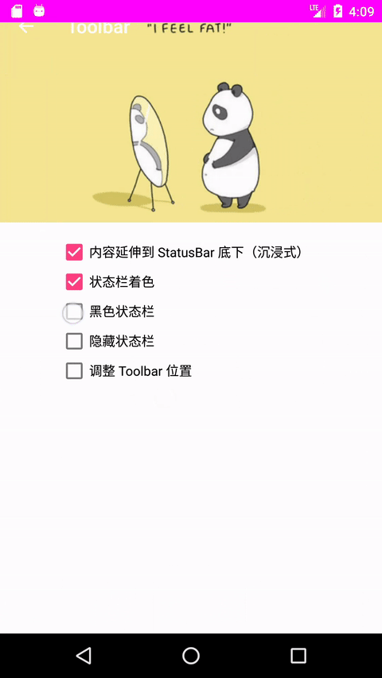

# AndroidNavigation 

A library managing nested Fragment, translucent StatusBar and Toolbar for Android. 

You could use it as a single Activity Architecture Component. 

This is also the subproject of [react-native-navigation-hybrid](https://github.com/listenzz/react-native-navigation-hybrid).

[**Download demo apk**](https://raw.githubusercontent.com/listenzz/AndroidNavigation/master/screenshot/demo-release.apk)

## 特性

- 一行代码实现 Fragment 嵌套，一次性构建好嵌套层级
- 一行代码实现 Fragment 跳转，不再需要写一大堆操作 fragment 的代码了，不用担心用错 FragmentManager 了
- 一行代码开关沉浸式状态栏，兼容到 Android 4.4 并解决了相关 BUG
- 自动为你创建 Toolbar，一行代码设置标题、按钮，支持关闭自动创建功能以实现定制
- 一处设置全局样式，到处使用，并且支持不同页面个性化
- 支持侧滑返回
- 支持懒加载
- 支持 font icons

### 6.0 screenshot:

 

 

## Installation

```groovy
implementation 'me.listenzz:navigation:1.8.5'
```

## Usage 

#### [构建UI层级](#building-hierarchy)
#### [导航](#navigation)
#### [懒加载](#lazy-load)
#### [全局样式设置](#setting-style)
#### [设置状态栏](#setting-statusbar)
#### [设置 Toolbar](#setting-toolbar)
#### [使用 font icons](#using-font-icons)
#### [代码规范](#specification)

--------
<a name="building-hierarchy"></a>


### 构建UI层级

你的 Fragment 需要继承 AwesomeFragment。

你的 Acvitity 需要继承 AwesomeActivity，然后设置 rootFragment。

```java
public class MainActivity extends AwesomeActivity {

    @Override
    protected void onCreate(Bundle savedInstanceState) {
        super.onCreate(savedInstanceState);
        if (savedInstanceState == null) {
            TestFragment testFragment = new TestFragment();
            setActivityRootFragment(testFragment);
        }
    }
    
}
```

你可以调用 `setActivityRootFragment` 多次，根据不同的 App 状态展示不同的根页面。比如一开始你只需要展示个登录页面，登陆成功后将根页面设置成主页面。

AwesomeFragment 同样部署了 setActivityRootFragment 接口，方便你随时随地切换 activity 的根。

你通常还需要另外一个 Activity 来做为闪屏页（Splash），这个页面则不必继承 AweseomActivity。

为了处理常见的 Fragment 嵌套问题，提供了 `NavigationFragment`、`TabBarFragment`、`DrawerFragment` 三个容器类。它们可以作为 Activity 的 rootFragment 使用。这三个容器为 Fragment 嵌套提供了非常便利的操作。

#### NavigationFragment

NavigationFragment 以栈的形式管理它的子 Fragment，支持 push、pop 等操作，在初始化时，需要为它指定 rootFragment。

```java
public class MainActivity extends AwesomeActivity {
    @Override
    protected void onCreate(Bundle savedInstanceState) {
        super.onCreate(savedInstanceState);
        if (savedInstanceState == null) {
            TestFragment testFragment = new TestFragment();
            NavigationFragment navigationFragment = new NavigationFragment();
            // 把 TestFragment 设置为 NavigationFragment 的根
            navigationFragment.setRootFragment(testFragment);
            // 把 NavigationFragment 设置为 Activity 的根
            setActivityRootFragment(navigationFragment);
        }
    }
}
```

如果 TestFragment 的根布局是 LinearLayout 或 FrameLayout，会自动帮你创建 Toolbar，当由 A 页面跳转到 B 页面时，会为 B 页面的 Toolbar 添加返回按钮。更多关于 Toobar 的配置，请参考 [**设置 Toolbar**](#setting-toolbar) 一章。

在 TestFragment 中，我们可以通过 `getNavigationFragment` 来获取套在它外面的 NavigationFragment，然后通过 NavigationFragment 提供的 `pushFragment` 跳转到其它页面，或通过 `popFragment` 返回到前一个页面。关于导航的更多细节，请参考 [**导航**](#navigation) 一章。

#### TabBarFragment

这也是一个比较常见的容器，一般 APP 主界面底下都会有几个 tab，点击不同的 tab 就切换到不同的界面。

```java
public class MainActivity extends AwesomeActivity {

    @Override
    protected void onCreate(Bundle savedInstanceState) {
        super.onCreate(savedInstanceState);
        if (savedInstanceState == null) {
            
            // 首页
            HomeFragment homeFragment = new HomeFragment();
            homeFragment.setTabBarItem(new TabBarItem(R.drawable.icon_home, "首页"));
            
            // 通讯录
            ContactsFragment contactsFragment = new ContactsFragment();
            contactsFragment.setTabBarItem(new TabBarItem(R.drawable.icon_contacts, "通讯录"));
            
            // 添加 tab 到 TabBarFragment
            TabBarFragment tabBarFragment = new TabBarFragment(); 
            tabBarFragment.setFragments(homeFragment, contactsFragment);
            
            // 把 TabBarFragment 设置为 Activity 的根
            setActivityRootFragment(tabBarFragment);
        }
    }
    
}
```

在 HomeFragment 或 ContactsFragment 中，可以通过 `getTabBarFragment` 来获取它们所属的 TabBarFragment.

可以通过 TabBarFragment 的 `setSelectedIndex` 方法来动态切换 tab，通过 `getTabBar` 可以获取 TabBar, 然后可以调用 TabBar 提供的方法来设置红点，未读消息数等。

如果对提供的默认 TabBar 不满意，可以通过实现 `TabBarProvider` 来自定义 TabBar , 在设置 TabBarFragment 为其它容器的根前，调用 `TabBarFragament#setTabBarProvider` 来设置自定义的 TabBar, 参数可以为 null, 表示不需要 TabBar.


如果 HomeFragment 或 ContactsFragment 需要有导航的能力，可以先把它们嵌套到 NavigationFragment 中。

```java
public class MainActivity extends AwesomeActivity {

    @Override
    protected void onCreate(Bundle savedInstanceState) {
        super.onCreate(savedInstanceState);
        if (savedInstanceState == null) {
            
            // 首页
            HomeFragment homeFragment = new HomeFragment();
            NavigationFragment homeNavigatoinFragment = new NavigationFragment();
            homeNavigationFraggment.setRootFragment(homeFragment);
            homeNavigatoinFragment.setTabBarItem(new TabBarItem(R.drawable.icon_home, "首页"));
            
            // 通讯录
            ContactsFragment contactsFragment = new ContactsFragment();
            NavigationFragment contactsNavigationFragment = new NavigationFragment();
            contactsNavigationFragment.setRootFragment(contactsFragment);
            contactsNavigationFragment.setTabBarItem(new TabBarItem(R.drawable.icon_contacts, "通讯录"));
            
            // 添加 tab 到 TabBarFragment 
            TabBarFragment tabBarFragment = new TabBarFragment();
            tabBarFragment.setFragments(homeNavigatoinFragment, contactsNavigationFragment);
            
            // 把 TabBarFragment 设置为 Activity 的根
            setActivityRootFragment(tabBarFragment);
        }
    }
    
}
```

#### DrawerFragment

这个容器内部封装了 DrawerLayout。使用时需要为它设置两个子 Fragment。

```java
public class MainActivity extends AwesomeActivity {

    @Override
    protected void onCreate(Bundle savedInstanceState) {
        super.onCreate(savedInstanceState);
        if (savedInstanceState == null) {
        
            DrawerFragment drawerFragment = new DrawerFragment();
            drawerFragment.setContentFragment(new ContentFragment());
            drawerFragment.setMenuFragment(new MenuFragment());
            
            // 把 drawerFragment 设置为 Activity 的根
            setActivityRootFragment(drawerFragment);
        }
    }
    
}
```

在 ContentFragment 或 MenuFragment 中，我们可以通过 `getDrawerFragment` 来获取它们所属的 DrawerFragment。

DrawerFragment 提供了 `toggleMenu`、`openMenu`、`closeMenu` 这几个方法来打开或关闭 Menu。

可以通过 `getContentFragment`、`getMenuFragment` 来获取对应的 Fragment。

可以通过 `setMinDrawerMargin` 或 `setMaxDrawerWidth` 来设置 menu 的宽度

contentFragment 可以是一个像 TabBarFragment 这样的容器。可以参考 demo 中 MainActivity 中的设置。

#### 自定义容器

如果以上容器都不能满足你的需求，你可以自定义容器。

> 容器在添加子 fragment 时一定要注意判断 savedInstanceState 是否为 null, 会不会在生命周期重启时，重复添加 fragment。

可以参考 demo 中 ViewPagerFragment 这个类，它就是个自定义容器。

自定义容器，继承 AwesomeFragment 并重写下面这个方法。

```java
@Override
public boolean isParentFragment() {
    return true;
}
```

因为 AwesomeFragment 会为非容器类 Fragment 的 root view 添加背景。如果容器不表明它是容器，也会为容器添加背景，这样就会导致不必要的 overdraw。

可能需要有选择地重写以下方法

```java
@Override
protected AwesomeFragment childFragmentForAppearance() {
    // 这个方法用来控制当前的 statusbar 的样式是由哪个子 fragment 决定的    
    // 如果不重写，则由容器自身决定
    // 可以参考 NavigationFragment、TabBarFragment
    // 是如何决定让哪个子 fragment 来决定 statusbar 样式的
    return 一个恰当的子 fragment;
}
```

如何使不同 fragment 拥有不同的 statusbar 样式，请参考 [**设置状态栏**](#setting-statusbar) 一章


<a name="navigation"></a>

```java
@Override
protected boolean onBackPressed() {
    // 这个方法用来控制当用户点击返回键时，到底要退出哪个子 fragment
    // 返回 true 表示当前容器消费了此事件，否则转发给上一层容器处理
    // 可以参考 DrawerFragment，NavigationFragment 是如何处理返回键的
    return super.onBackPressed();
}
```
> 非容器页面也可以重写 `onBackPressed` 来处理用户点击返回按钮事件。


### 导航

导航是指页面间的跳转和传值，实际上和容器如何管理它的子 Fragment 有很大关系。

#### present & dismiss

AwesomeActivity 和 AwesomeFragment 提供了两个基础的导航功能 present 和 dismiss

- present

	present 是一种模态交互方式，只有关闭被 present 的页面，才可以回到上一个页面，通常要求 presented 的页面给 presenting 的页面返回结果，类似于 `startActivityForResult`。
	
	比如 A 页面 present 出 B 页面
	
	```java
    // A.java
    presentFragment(testFragment, REQUEST_CODE);
	```
	
	B 页面返回结果给 A 页面 
	
	```java
    // B.java
    Bundle result = new Bundle();
    result.putString("text", resultEditText.getText().toString());
    setResult(Activity.RESULT_OK, result);
    dismissFragment();
	```
	
	A 页面实现 `onFragmentResult` 来接收这个结果
	
	```java
	// A.java
    @Override
    public void onFragmentResult(int requestCode, int resultCode, Bundle data) {
        super.onFragmentResult(requestCode, resultCode, data);
        if (requestCode == REQUEST_CODE) {
            if (resultCode != 0) {
                String text = data.getString("text", "");
                resultText.setText("present result：" + text);
            } else {
                resultText.setText("ACTION CANCEL");
            }
        }
    }
	```
	
	有些时候，比如选择一张照片，我们先要跳到相册列表页面，然后进入某个相册选择相片返回。这也是没有问题的。
	
	A 页面 present 出相册列表页面
	
	```java
    //AFragment.java
    NavigatoinFragment navigationFragment = new NavigationFragment();
    AlbumListFragment albumListFragment = new AlbumListFragment();
    navigationFragment.setRootFragment(albumListFragment);
    presentFragment(navigationFragment, 1)
	```
	
	相册列表页面 push 到某个相册
	
	> push 是 NavigationFragment 的能力，要使用这个功能，你的 fragment 外层必须有一个 NavigationFragment 做为容器。
	
	```java
    // AlbumListFragment.java
    AlbumFragment albumFragment = new AlbumFragment();
    getNavigationFragment.pushFragment(albumFragment);
	```
	
	在相册页面选好相片后返回结果给 A 页面
	
	```java
    // AlbumFragment.java
    Bundle result = new Bundle();
    result.putString("uri", "file://...");
    setResult(Activity.RESULT_OK, result);
    dismissFragment();
	```
	
	在 A 页面接收返回的结果（略）。
	
- dismiss

	关闭 present 出来的 Fragment，可以在该 Fragment 的任意子 Fragment 中调用，请参看上面相册的例子。
	
> present 所使用的 FragmentManager 是 Activity 的 `getSupportFragmentManager`，因此 present 出来的 fragment 是属于 Activity 的，它不属于任何 fragment 的子 fragment，这样就确保了 present 出来的 fragment 是模态的。

- showDialog

    把一个 fragment 作为 dialog 显示。showDialog 的参数列表和 present 是一样的，使用方式也基本相同。作为 dialog 的 fragment 可以通过 setResult 返回结果给把它作为 dialog show 出来的那个 fragment。
    
    
- dismissDialog

    关闭作为 dialog 的 fragment
    
- onBackPressed

    通过重写该方法，并返回 true，可以拦截返回键事件。


#### NavigationFragment

NavigationFragment 是个容器，以栈的方式管理子 fragment，支持 push、pop、popTo、popToRoot 操作，并额外支持 replace 和 replaceToRoot 操作。

我们可以在它的子 Fragment 中（不必是直接子 fragment，可以是子 fragment 的子 fragment）通过 `getNavigationFragment` 来获取它的引用。

在初始化 NavigationFragment 时，你必须调用 `setRootFragment` 来指定它的根页面。请参考上面相册那个例子的做法。`setRootFragment` 只能调用一次，如果想更换根页面，可以使用 `replaceToRootFragment` 这个方法。

- push

    入栈，由 A 页面跳转到 B 页面。
	
	```java
	// AFragment.java
   getNavigationFragment.pushFragment(bFragment);
	```

- pop

	出栈，返回到前一个页面。比如你由 A 页面 push 到 B 页面，现在想返回到 A 页面。
	
	```java
    // BFragment.java
    getNavigationFragment.popFragment();
	```
	
- 手势返回

    手势返回是 NavigationFragment 的能力，需要在 Activity 的 onCustomStyle 中开启。手势返回实质上是个 pop.
	
- popToRoot

	出栈，返回到当前导航栈根页面。比如 A 页面是根页面，你由 A 页面 push 到 B 页面，由 B 页面 push 到 C 页面，由 C 页面 push 到 D 页面，现在想返回到根部，也就是 A 页面。
	
	```java
    // DFragment.java
    getNavigationFragment.popToRootFragment();
	```

- popTo

	出栈，返回到之前的指定页面。比如你由 A 页面 push 到 B 页面，由 B 页面 push 到 C 页面，由 C 页面 push到 D 页面，现在想返回 B 页面。你可以把 B 页面的 `sceneId` 一直传递到 D 页面，然后调用 `popToFragment("bSceneId")` 返回到 B 页面。
	
	从 B 页面跳转到 C 页面时
	
	```java
    // BFragment.java
    CFragment cFragment = new CFragment();
    Bundle args = FragmentHelper.getArguments(cFragment);
    // 把 bSceneId 传递给 C 页面
    args.putString("bSceneId", getSceneId());
    getNavigationFragment().pushFragment(cFragment);
	```
	
	从 C 页面跳到 D 页面时 
	
	```java
    // CFragment.java
    DFragment dFragment = new DFragment();
    Bundle args = FragmentHelper.getArguments(dFragment);
    // 把 bSceneId 传递给 D 页面
    args.putString("bSceneId", getArguments().getString("bSceneId"));
    getNavigationFragment().pushFragment(dFragment);
	```
	
	现在想从 D 页面 返回到 B 页面
	
	```java
    // DFragment.java
    String bSceneId = getArguments().getString("bSceneId");
    BFragment bFragment = (AwesomeFragment)getFragmentManager().findFragmentByTag(bSceneId);
    getNavigationFragment().popToFragment(bFragment);
	```
	
    > 你可能已经猜到，pop 和 popToRoot 都是通过 popTo 来实现的。pop 的时候也可以通过 setResult 设置返回值，不过此时 requestCode 的值总是 0。

- replace

	出栈然后入栈，用指定页面取代当前页面，比如当前页面是 A，想要替换成 B
	
	```java
    // AFragment.java
    BFragment bFragment = new BFragment();
    getNavigationFragment().replaceFragment(bFragment);
	```

- replaceToRoot

	出栈然后入栈，把 NavigationFragment 的所有子 Fragment 替换成一个 Fragment。譬如 A 页面是根页面，然后 push 到 B、C、D 页面，此时 NavigationFragment 里有 A、B、C、D 四个页面。如果想要重置NavigationFragment ，把 E 页面设置成根页面。
	
	```java
    // DFragment.java
    EFragment eFragment = new EFragment();
    getNavigationFragment().replaceToRootFragment(eFragment);
	```
	
	现在 NavigationFragment 里只有 EFragment 这么一个子 Fragment 了。

- isNavigationRoot

    通过这个方法，可以判断当前 fragment 是不是 NavigationFragment 的 rootFragment
    

上面这些操作所使用的 FragmentManager，是 NavigationFragment 的 `getChildFragmentManager`，所有出栈或入栈的 fragment 都是 NavigationFragment 的子 fragment. 


如上图，A fragment 嵌套在 NavigationFragment 中，A1 fragment 嵌套在 A fragment 中，当我们从 A1 push B fragment 时，B fragment 会成为 NavigationFragment 的子 fragment，而不是 A 的子 fragment，它和 A 是兄弟，它是 A1 的叔叔。

#### 自定义导航

虽然 AwesomeFragment 和 NavigationFragment 提供的导航操作已经能满足大部分需求，但有时我们可能需要自定义导航操作，尤其是自定义容器的时候。

需要注意几个点

- 选择合适的 FragmentManager
  
  `Activity#getSupportFragmentManager` 会将 fragment 添加到 activity
  
  `Fragment#getFragmentManager` 拿到的是上一级的 fragmentManager, 通过它添加的 fragment 会成为当前 fragment 的兄弟。
  
  `Fragment#getChildFragmentManager` 会将 fragment 添加为当前 fragment 的子 fragment。

- 设置正确的 tag

  总是使用有三个参数的 add、replace 等方法，最后一个 tag 传入目标 fragment 的 `getSceneId` 的值。
  
- 正确使用 addToBackStack

  如果需要添加到返回栈，tag 参数不能为 null, 必须和传递给 add 或 replace 的 tag 一致，也就是目标 fragment 的 `getSceneId` 的值。
  
- 如果不通过栈的形式来管理子 fragment 时，必须将当前子 fragment 设置为 primaryNavigationFragment

    参考 TabBarFragment 和 DrawerFragment，它们就不是用栈的形式管理子 fragment.

    ```
    getFragmentManager().setPrimaryNavigationFragment(fragment);
    ```
    
- 一个容器中的子 fragment 要不都添加到返回栈中，就像 NavigationFragment 那样，要不都不添加到返回栈中，就像 TabBarFragment 和 DrawerFragment 那样，切勿混用这两种模式。
    
可以参考 demo 中 GridFragment 这个类，看如何实现自定义导航的，它遵循了 NavigationFragment 管理子 fragment 的规则。


<!---->


<a name="lazy-load"></a>

### 懒加载

AwesomeFragment 提供了两个额外的生命周期回调

```java
protected void onViewAppear();
protected void onViewDisappear();
```

可以通过它们实现懒加载


<a name="setting-style"></a>


### 全局样式设置

可以通过重写 AwesomeActivity 如下方法来定制该 activity 下所有 fragment 的样式

```java
@Override
protected void onCustomStyle(Style style) {
    
}
```

可配置项如下：

```javascript  
{
    screenBackgroundColor: int       // 页面背景，默认是白色
    statusBarStyle: BarStyle         // 状态栏和 toolbar 前景色，可选值有 DarkContent 和 LightContent
    statusBarColor: String           // 状态栏背景色，仅对 4.4 以上版本生效， 默认值是 colorPrimaryDark
    toolbarBackgroundColor: int      // toolbar 背景颜色，默认值是 colorPrimary
    elevation: int                   // toolbar 阴影高度， 仅对 5.0 以上版本生效，默认值为 4 dp
    shadow: Drawable                 // toolbar 阴影图片，仅对 4.4 以下版本生效 
    backIcon: Drawable               // 返回按钮图标，默认是个箭头
    toolbarTintColor: int            // toolbar 按钮的颜色，默认根据 statusBarStyle 来推算
    titleTextColor: int              // toolbar 标题颜色，默认根据 statusBarStyle 来推算
    titleTextSize: int               // toolbar 标题字体大小，默认是 17 dp
    titleGravity: int                // toolbar 标题的位置，默认是 Gravity.START
    toolbarButtonTextSize: int       // toolbar 按钮字体大小，默认是 15 dp
    swipeBackEnabled: boolean.       // 是否支持手势返回，默认是 false
    badgeColor: String               // Badge 背景颜色 
     
    // BottomBar
    bottomBarBackgroundColor: String // BottomNavigationBar 背景，默认值是 #FFFFFF
    bottomBarShadow: Drawable        // BottomNavigationBar 阴影图片，仅对4.4 以下版本生效 
    bottomBarActiveColor: String     // BottomNavigationTab 选中效果，默认取 colorAccent 的值
    bottomBarInactiveColor: String   // BottomNavigationTab 未选中效果，默认是灰色
}
```

所有的可配置项都是可选的。

如果某个 fragment 与众不同，可以为该 fragment 单独设置样式，只要重写 fragment 的 `onCustomStyle` 方法，在其中设置那些不同的样式即可。

<a name="setting-statusbar"></a>


### 设置状态栏

状态栏的设置支持 4.4 以上系统。


设置方式非常简单，只需要有选择地重写 AwesomeFragmet 中的方法即可。

```java
// AwesomFragment.java
protected BarStyle preferredStatusBarStyle();
protected boolean preferredStatusBarHidden();
protected int preferredStatusBarColor();
protected boolean preferredStatusBarColorAnimated();
```	

- preferredStatusBarStyle

  默认的返回值是全局样式的 `style.getStatusBarStyle()`。
  
  BarStyle 是个枚举，有两个值。`LightContent` 表示状态栏文字是白色，如果你想把状态栏文字变成黑色，你需要使用 `DarkContent`。
 
  > 仅对 6.0 以上版本以及小米、魅族生效
  
- preferredStatusBarHidden

  状态栏是否隐藏，默认是不隐藏。如果你需要隐藏状态栏，重写这个方法，把返回值改为 true 即可。
 
- preferredStatusBarColor

  状态栏的颜色，默认是全局样式 `style.getStatusBarColor()`，如果某个页面比较特殊，重写该方法，返回期待的颜色值即可。
    
- preferredStatusBarColorAnimated

  当状态栏的颜色由其它颜色转变成当前页面所期待的颜色时，需不需要对颜色做过渡动画，默认是 true，使得过渡更自然。如果过渡到某个界面状态栏出现闪烁，你需要在目标页面关闭它。参考 demo 中 TopDialogFragment 这个类。
 
如果你当前页面的状态栏样式不是固定的，需要根据 App 的不同状态展示不同的样式，你可以在上面这些方法中返回一个变量，当这个变量的值发生变化时，你需要手动调用 `setNeedsStatusBarAppearanceUpdate` 来通知框架更新状态栏样式。可以参考 demo 中 ViewPagerFragment 这个类。

#### 开启沉浸式 

这里的沉浸式是指页面的内容延伸到 statusBar 底下

只需要调用 `setStatusBarTranslucent(boolean translucent)` 即可开关沉浸式，AwesomeActivity 和 AwesomeFragment 都有这个方法，这个方法会影响整个 Activity 中所有的 Fragment，请慎重使用。

AwesomeFragment 中有一个 `onStatusBarTranslucentChanged(boolean translucent)` 方法，你可以在这里处理开关沉浸式所要做的适配工作。

你也可以通过 `isStatusBarTranslucent` 来判断是否开启了沉浸式。

我们的 demo 在 MainActivity 中开启了沉浸式，你可以在 CustomStatusBarFragment 这个界面开关沉浸式




<a name="setting-toolbar"></a>

### 设置 Toolbar


当 fragment 的 parent fragment 是一个 NavigationFragemnt 时，会自动为该 fragment 创建 Toolbar。

你可以调用 AwesomeFragment 的以下方法来设置 Toolbar

- setTitle

    设置 Toolbar 标题

- setLeftBarButtonItem

    设置 Toolbar 左侧按钮
  
- setLeftBarButtonItems

    为左侧设置多个按钮时，使用此方法
  
- setRightBarButtonItem

    设置 Toolbar 右侧按钮，
  
- setRightBarButtonItems

    为右侧设置多个按钮时，使用此方法
  
    当然，你也可以设置 Menu
  
    ```java
    Menu menu = getToolbar().getMenu();
    MenuItem menuItem = menu.add(title);
    menuItem.setIcon(icon);
    menuItem.setShowAsAction(MenuItem.SHOW_AS_ACTION_IF_ROOM);
    menuItem.setOnMenuItemClickListener();
    ```
  
> 请在 `onActivityCreated` 中调用上面这些方法

Toolbar 的创建时机是在 Fragment `onViewCreated` 这个生命周期函数中，在此之前之前，调用 getAwesomeToolbar 得到的返回值为 null。

如果当前 fragment 不是 NavigationFragment 的 rootFragment，会自动在 Toolbar 上创建返回按钮。如果你不希望当前页面有返回按钮，可以重写以下方法。

```java
protected boolean shouldHideBackButton() {
    return true;
}
```

如果你希望禁止用户通过返回键（物理的或虚拟的）或者手势退出当前页面，你可以重写以下方法，并返回 false。

```java
protected boolean backInteractive() {
    return false;
}
```

如果只是希望禁止用户通过手势退出当前页面，重写以下方法，返回 false，此时用户仍然可以通过返回键退出当前页面。

```java
protected boolean isSwipeBackEnabled() {
    return false;
}
```


如果你不希望自动为你创建 toolbar, 或者自动创建的 toolbar 所在 UI 层级不合适，你可以重写以下方法，返回 null 或者自定义的 toolbar。

```java
protected AwesomeToolbar onCreateAwesomeToolbar(View parent) { 
    return null;
}
```

demo 中，NoToolbarFragment 返回 null， 表示不需要创建 toolbar。如果需要自定义 toolbar，请优先考虑基于 AwesomeToolbar 进行自定义，并在 onCreateAwesomeToolbar 返回自定义的 toolbar，就像 CoordinatorFragment 和 ViewPagerFragment 所做的那样，你可能还需要重写 onCustomStyle 这个方法，来修改 toolbar 的样式。

如果开启了沉浸式，那么需要使用 `appendStatusBarPadding` 这个方法来给恰当的 view 添加 padding，请参考上面说到的那两个类。

<a name="using-font-icons"></a>

### 使用 font icons

把你的 font icon 文件放到 assets/fonts 目录中，就像 demo 所做的那样。每个图标会有一个可读的 name， 以及一个 code point，我们通常通过 name 来查询 code point，当然也可以人肉查好后直接使用 code point，demo 中就是这样。

以下方法可以通过 code point 获取 glyph（字形）

```java
public static String fromCharCode(int... codePoints) {
    return new String(codePoints, 0, codePoints.length);
}
```

获取 glyph 后构建如下格式的 uri

```
font://fontName/glyph/size/color
```

其中 fontName 就是你放在 aseets/fonts 文件夹中的字体文件名，但不包括后缀。size 是字体大小，如 24，color 是字体颜色，可选，只支持 RRGGBB 格式。

可以参考 demo 中 MainActivity 中是怎样构建一个 fontUri 的。

<a name="specification"></a>

### 代码规范

- 在 `onActivityCreated` 中配置和 Toolbar 相关的东西，比如设置标题、按钮。

- 永远通过以下方式来获取 arguments, 否则后果很严重
    
    获取
    
    ```java
    Bundle args = FragmentHelper.getArguments(fragment);
    ```

    设置
    
    ```java
    TargetFragemnt target = new TargetFragemnt();
    Bundle args = FragmentHelper.getArguments(target);
    args.putInt("id", 1);
    getNavigationFragment().pushFragment(target);
    ```
