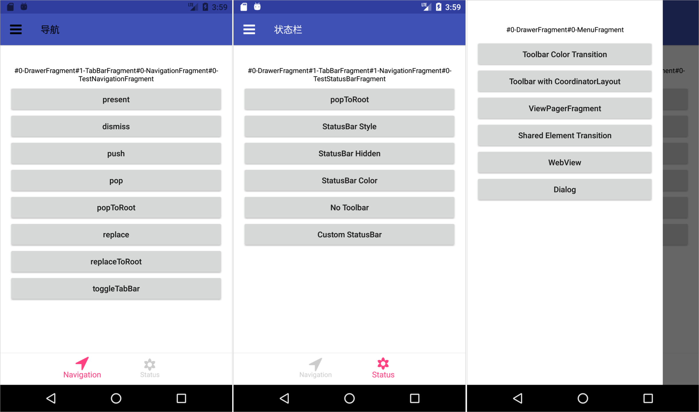

# AndroidNavigation
A Library that manage Nested Fragment, StatusBar and Toolbar for You! 

You could use it as a single Activity Architecture Component.

### 6.0 screenshot:

 

 

 
### Video
 
<video width="360" height="640" controls>
<source src="./screenshot/navigation.mp4">
</video>

## 特性

- 使用 Lifecycle 架构组件，解决了生命周期问题
- 以 iOS 的导航系统为参照，支持 push, pop, popTo, popToRoot, present, dismiss, replace, replaceToRoot 等操作
- 支持 StatusBar, Toolbar, BottomBar 的全局样式配置以及局部调整
- 支持 font icons

## Compare with iOS

AndroidNavigation | iOS
------|----
AwesomeActivity | Window
AwesomeActivity#setRootFragment | Window#rootViewController
AwesomeFragment | UIViewController
NavigationFragment | UINavigationController
TabBarFragment | UITabBarController
DrawerFragment | -

## Api

### AweseomActivity

你的 Acvitity 需要继承 AweseomActivity，然后设置 rootFragment

```java
public class MainActivity extends AwesomeActivity {

    @Override
    protected void onCreate(Bundle savedInstanceState) {
        super.onCreate(savedInstanceState);
        if (savedInstanceState == null) {
            TestFragment testFragment = new TestFragment();
            setRootFragment(testFragment);
        }
    }
    
}
```
你可以调用 setRootFragment 多次，根据不同的 App 状态展示不同的根页面。比如一开始你只需要展示个登录页面，登陆成功后将根页面设置成主页面。

你通常还需要另外一个 Activity 来做为闪屏页（Splash），这个页面则不必继承 AweseomActivity。

### AwesomeFragment

这是个基类，大多数情况下，你总是继承这个类来完成你的页面。

这个类提供了两个基础的导航功能 present 和 dismiss

- present

	present 是一种模态交互模式，类似于 `startActivityForResult`，要求 presented 的页面给 presenting 的页面返回结果。
	
	比如 A 页面 present 出 B 页面
	
	```java
    // A.java
    presentFragment(testFragment, REQUEST_CODE);
	```
	
	B 页面返回结果给 A 页面 
	
	```java
    // B.java
    Bundle result = new Bundle();
    result.putString("text", resultEditText.getText().toString());
    setResult(Activity.RESULT_OK, result);
    dismissFragment();
	```
	
	A 页面实现 `onFragmentResult` 来接收这个结果
	
	```java
	// A.java
    @Override
    public void onFragmentResult(int requestCode, int resultCode, Bundle data) {
        super.onFragmentResult(requestCode, resultCode, data);
        if (requestCode == REQUEST_CODE) {
            if (resultCode != 0) {
                String text = data.getString("text", "");
                resultText.setText("present result：" + text);
            } else {
                resultText.setText("ACTION CANCEL");
            }
        }
    }
	```
	
	有些时候，比如选择一张照片，我们先要跳到相册列表页面，然后进入某个相册选择相片返回。这也是没有问题的。
	
	A 页面 present 出相册列表页面
	
	```java
    //AFragment.java
    NavigatoinFragment navigationFragment = new NavigationFragment();
    AlbumListFragment albumListFragment = new AlbumListFragment();
    navigationFragment.setRootFragment(albumListFragment);
    presentFragment(navigationFragment, 1)
	```
	
	相册列表页面 push 到某个相册
	
	> push 是 NavigationFragment 的能力，要使用这个功能，你的 fragment 外层必须有一个 NavigationFragment 做为容器。
	
	```java
    // AlbumListFragment.java
    AlbumFragment albumFragment = new AlbumFragment();
    getNavigationFragment.pushFragment(albumFragment);
	```
	
	在相册页面选好相片后返回结果给 A 页面
	
	```java
    // AlbumFragment.java
    Bundle result = new Bundle();
    result.putString("uri", "file://...");
    setResult(Activity.RESULT_OK, result);
    dismissFragment();
	```
	
	在 A 页面接收返回的结果（略）。
	
- dismiss

	关闭 present 出来的 Fragment，可以在该 Fragment 的任意子 Fragment 中调用，请参看上面相册的例子。
	
### NavigationFragment

对标 iOS 的 UINavigationController，支持 push、pop、popTo、popToRoot 操作，并额外支持 replace 和 replaceToRoot 操作。

NavigationFragment 是个容器，你可以在它的子 Fragment 中通过 `getNavigationFragment` 来获取它的引用。

在初始化 NavigationFragment 时，你必须调用 `setRootFragment` 来指定它的根页面。请参考上面相册那个例子的做法。`setRootFragment` 只能调用一次，如果想更换根页面，可以使用 `replaceToRootFragment` 这个方法。

- push

	由 A 页面跳转到 B 页面。
	
	```java
	// AFragment.java
   getNavigationFragment.pushFragment(bFragment);
	```

- pop

	返回到前一个页面。比如你由 A 页面 push 到 B 页面，现在想返回到 A 页面。
	
	```java
    // BFragment.java
    getNavigationFragment.popFragment();
	```
	
- popToRoot

	返回到当前导航栈根页面。比如 A 页面是根页面，你由 A 页面 push 到 B 页面，由 B 页面 push 到 C 页面，由 C 页面 push 到 D 页面，现在想返回到根部，也就是 A 页面。
	
	```java
    // DFragment.java
    getNavigationFragment.popToRootFragment();
	```

- popTo

	返回到之前的指定页面。比如你由 A 页面 push 到 B 页面，由 B 页面 push 到 C 页面，由 C 页面 push到 D 页面，现在想返回 B 页面。你可以把 B 页面的 `sceneId` 一直传递到 D 页面，然后调用 `popToFragment("bSceneId")` 返回到 B 页面。
	
	从 B 页面跳转到 C 页面时
	
	```java
    // BFragment.java
    CFragment cFragment = new CFragment();
    Bundle args = new Bundle();
    args.putString("bSceneId", getSceneId());
    cFragment.setArguments(args);
    getNavigationFragment().pushFragment(cFragment);
	```
	
	从 C 页面跳到 D 页面时 
	
	```java
    // CFragment.java
    DFragment dFragment = new DFragment();
    Bundle args = new Bundle();
    // 把 bSceneId 传递给 D 页面
    args.putString("bSceneId", getArguments().getString("bSceneId"));
    dFragment.setArguments(args);
    getNavigationFragment().pushFragment(dFragment);
	```
	
	现在想从 D 页面 返回到 B 页面
	
	```java
    // DFragment.java
    String bSceneId = getArguments().getString("bSceneId");
    BFragment bFragment = (AwesomeFragment)getFragmentManager().findFragmentByTag(bSceneId);
    getNavigationFragment().popToFragment(bFragment);
	```
	
    > 你可能已经猜到，pop 和 popToRoot 都是通过 popTo 来实现的。

- replace

	用指定页面取代当前页面，比如当前页面是 A，想要替换成 B
	
	```java
    // AFragment.java
    BFragment bFragment = new BFragment();
    getNavigationFragment().replaceFragment(bFragment);
	```

- replaceToRoot

	把 NavigationFragment 的所有子 Fragment 替换成一个 Fragment。譬如 A 页面是根页面，然后 push 到 B、C、D 页面，此时 NavigationFragment 里有 A、B、C、D 四个页面。如果想要重置NavigationFragment ，把 E 页面设置成根页面。
	
	```java
    // DFragment.java
    EFragment eFragment = new EFragment();
    getNavigationFragment().replaceToRootFragment(eFragment);
	```
	
	现在 NavigationFragment 里只有 EFragment 这么一个子 Fragment 了。

### TabBarFragment

coming soon

### DrawerFragment

coming soon


### 配置页面的状态栏

AwesomeFragment 中有几个模版方法是用来配置状态栏的，如果你希望某些页面的状态栏和其它页面不一样，你需要有选择性的重写这些方法。

目前尚未对 5.0 以下版本做兼容，以及兼容部分国产机。

```java
// AwesomFragment.java
protected String preferredStatusBarStyle();
protected boolean prefersStatusBarHidden();
protected int prefersStatusBarColor();
protected boolean prefersStatusBarColorAnimated();
```	

- preferredStatusBarStyle

  默认的返回值是 light-content, 状态栏文字是白色，如果你想把状态栏文字变成黑色，你需要重写这个方法，把返回值改为 dark-content。
  
  > 仅对 6.0 以上版本生效
  
- prefersStatusBarHidden

  状态栏是否隐藏，默认是不隐藏。如果你需要隐藏状态栏，重写这个方法，把返回值改为 true 即可。
 
- prefersStatusBarColor

  状态栏的颜色，默认是 `Color.TRANSPARENT`, 即透明色。如果这不满足你的需求，你只需要重写这个方法，返回你需要的颜色即可。
  
- prefersStatusBarColorAnimated

  当状态栏的颜色由其它颜色转变成当前页面所期待的颜色时，需不需要对颜色做过渡动画，默认是 false，你可以返回 true，使得过渡更自然。
 
如果你当前页面的状态栏样式不是固定的，需要根据 App 的不同状态展示不同的样式，你可以在上面这些方法中返回一个变量，当这个变量的值发生变化时，你需要手动调用 `setNeedsStatusBarAppearanceUpdate` 来通知框架更新状态栏样式。可以参考 DrawerFragment 是怎样实现侧边栏弹出时隐藏状态栏，侧边栏收起时显示状态栏的。


