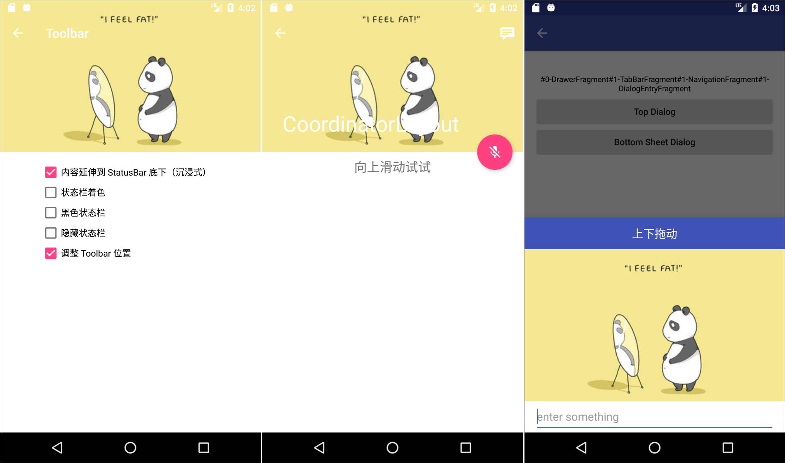
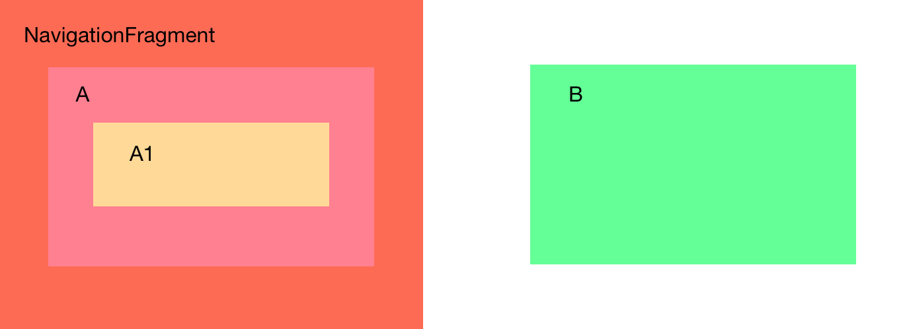
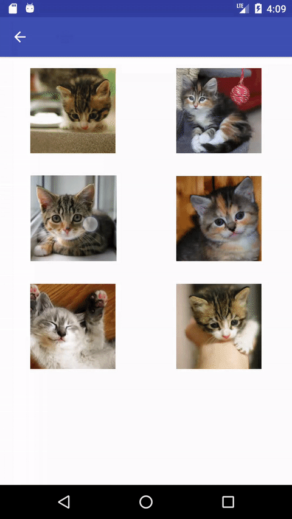
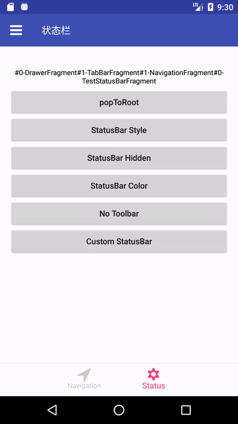

# AndroidNavigation

A library managing nested Fragment, translucent StatusBar and Toolbar for Android.

You could use it as a single Activity Architecture Component.

This is also the subproject of [hybrid-navigation](https://github.com/listenzz/hybrid-navigation).

[**Download demo apk**](https://raw.githubusercontent.com/listenzz/AndroidNavigation/master/screenshot/demo-release.apk)

## 特性

- 一行代码实现 Fragment 嵌套，一次性构建好嵌套层级
- 一行代码实现 Fragment 跳转，不再需要写一大堆操作 fragment 的代码了，不用担心用错 FragmentManager 了
- 可扩展性强，允许自定义容器和路由
- 自动为你创建 Toolbar，一行代码设置标题、按钮，支持关闭自动创建功能以实现定制
- 一处设置全局样式，到处使用，并且支持不同页面个性化
- 支持侧滑返回
- 支持懒加载
- 支持 font icons

### 6.0 screenshot:




## Installation

```groovy
implementation 'io.github.listenzz:AndroidNavigation:11.3.1'
implementation 'androidx.appcompat:appcompat:1.2.0'
```

```groovy
implementation 'io.github.listenzz:AndroidNavigation:12.5.10'
implementation 'androidx.appcompat:appcompat:1.3.1'
```

```groovy
allprojects {
    repositories {
        google()
        mavenCentral()
    }
}
```

## Usage

- [**构建 UI 层级**](#building-hierarchy)

- [**所见即所得 Dialog**](#WYSIWYG-dialog)

- [**导航**](#navigation)

- [**懒加载**](#lazy-load)

- [**全局样式设置**](#setting-style)

- [**设置状态栏**](#setting-statusbar)

- [**设置导航栏**](#setting-navigationbar)

- [**设置 Toolbar**](#setting-toolbar)

- [**使用 font icons**](#using-font-icons)

- [**代码规范**](#specification)

---

<a name="building-hierarchy"></a>

### 构建 UI 层级

你的 Fragment 需要继承 AwesomeFragment。

你的 Activity 需要继承 AwesomeActivity，然后设置 rootFragment。

```java
public class MainActivity extends AwesomeActivity {

    @Override
    protected void onCreate(Bundle savedInstanceState) {
        super.onCreate(savedInstanceState);
        if (savedInstanceState == null) {
            TestFragment testFragment = new TestFragment();
            setActivityRootFragment(testFragment);
        }
    }

}
```

你可以调用 `setActivityRootFragment` 多次，根据不同的 App 状态展示不同的根页面。比如一开始你只需要展示个登录页面，登陆成功后将根页面设置成主页面。

AwesomeFragment 同样部署了 setActivityRootFragment 接口，方便你随时随地切换 activity 的根。

你通常还需要另外一个 Activity 来做为闪屏页（Splash），这个页面则不必继承 AwesomeActivity。

为了处理常见的 Fragment 嵌套问题，提供了 `StackFragment`、`TabBarFragment`、`DrawerFragment` 三个容器类。它们可以作为 Activity 的 rootFragment 使用。这三个容器为 Fragment 嵌套提供了非常便利的操作。

#### StackFragment

StackFragment 以栈的形式管理它的子 Fragment，支持 push、pop 等操作，在初始化时，需要为它指定 rootFragment。

```java
public class MainActivity extends AwesomeActivity {
    @Override
    protected void onCreate(Bundle savedInstanceState) {
        super.onCreate(savedInstanceState);
        if (savedInstanceState == null) {
            TestFragment testFragment = new TestFragment();
            StackFragment stackFragment = new StackFragment();
            // 把 TestFragment 设置为 StackFragment 的根
            stackFragment.setRootFragment(testFragment);
            // 把 StackFragment 设置为 Activity 的根
            setActivityRootFragment(stackFragment);
        }
    }
}
```

如果 TestFragment 的根布局是 LinearLayout 或 FrameLayout，会自动帮你创建 Toolbar，当由 A 页面跳转到 B 页面时，会为 B 页面的 Toolbar 添加返回按钮。更多关于 Toolbar 的配置，请参考 [**设置 Toolbar**](#setting-toolbar) 一章。

在 TestFragment 中，我们可以通过 `getStackFragment` 来获取套在它外面的 StackFragment，然后通过 StackFragment 提供的 `pushFragment` 跳转到其它页面，或通过 `popFragment` 返回到前一个页面。关于导航的更多细节，请参考 [**导航**](#navigation) 一章。

#### TabBarFragment

这也是一个比较常见的容器，一般 APP 主界面底下都会有几个 tab，点击不同的 tab 就切换到不同的界面。

```java
public class MainActivity extends AwesomeActivity {

    @Override
    protected void onCreate(Bundle savedInstanceState) {
        super.onCreate(savedInstanceState);
        if (savedInstanceState == null) {

            // 首页
            HomeFragment homeFragment = new HomeFragment();
            homeFragment.setTabBarItem(new TabBarItem("首页", R.drawable.icon_home));

            // 通讯录
            ContactsFragment contactsFragment = new ContactsFragment();
            contactsFragment.setTabBarItem(new TabBarItem("通讯录", R.drawable.icon_contacts));

            // 添加 tab 到 TabBarFragment
            TabBarFragment tabBarFragment = new TabBarFragment();
            tabBarFragment.setFragments(homeFragment, contactsFragment);

            // 把 TabBarFragment 设置为 Activity 的根
            setActivityRootFragment(tabBarFragment);
        }
    }

}
```

在 HomeFragment 或 ContactsFragment 中，可以通过 `getTabBarFragment` 来获取它们所属的 TabBarFragment.

可以通过 TabBarFragment 的 `setSelectedIndex` 方法来动态切换 tab，通过 `getTabBar` 可以获取 TabBar, 然后可以调用 TabBar 提供的方法来设置红点，未读消息数等。

如果对提供的默认 TabBar 不满意，可以通过实现 `TabBarProvider` 来自定义 TabBar , 在设置 TabBarFragment 为其它容器的根前，调用 `TabBarFragment#setTabBarProvider` 来设置自定义的 TabBar, 参数可以为 null, 表示不需要 TabBar.

如果 HomeFragment 或 ContactsFragment 需要有导航的能力，可以先把它们嵌套到 StackFragment 中。

```java
public class MainActivity extends AwesomeActivity {

    @Override
    protected void onCreate(Bundle savedInstanceState) {
        super.onCreate(savedInstanceState);
        if (savedInstanceState == null) {

            // 首页
            HomeFragment homeFragment = new HomeFragment();
            StackFragment homeNavigationFragment = new StackFragment();
            homeNavigationFragment.setRootFragment(homeFragment);
            homeNavigationFragment.setTabBarItem(new TabBarItem("首页", R.drawable.icon_home));

            // 通讯录
            ContactsFragment contactsFragment = new ContactsFragment();
            StackFragment contactsNavigationFragment = new StackFragment();
            contactsNavigationFragment.setRootFragment(contactsFragment);
            contactsNavigationFragment.setTabBarItem(new TabBarItem("通讯录", R.drawable.icon_contacts));

            // 添加 tab 到 TabBarFragment
            TabBarFragment tabBarFragment = new TabBarFragment();
            tabBarFragment.setFragments(homeNavigationFragment, contactsNavigationFragment);

            // 把 TabBarFragment 设置为 Activity 的根
            setActivityRootFragment(tabBarFragment);
        }
    }

}
```

#### DrawerFragment

这个容器内部封装了 DrawerLayout。使用时需要为它设置两个子 Fragment。

```java
public class MainActivity extends AwesomeActivity {

    @Override
    protected void onCreate(Bundle savedInstanceState) {
        super.onCreate(savedInstanceState);
        if (savedInstanceState == null) {

            DrawerFragment drawerFragment = new DrawerFragment();
            drawerFragment.setContentFragment(new ContentFragment());
            drawerFragment.setMenuFragment(new MenuFragment());

            // 把 drawerFragment 设置为 Activity 的根
            setActivityRootFragment(drawerFragment);
        }
    }

}
```

在 ContentFragment 或 MenuFragment 中，我们可以通过 `getDrawerFragment` 来获取它们所属的 DrawerFragment。

DrawerFragment 提供了 `toggleMenu`、`openMenu`、`closeMenu` 这几个方法来打开或关闭 Menu。

可以通过 `getContentFragment`、`getMenuFragment` 来获取对应的 Fragment。

可以通过 `setMinDrawerMargin` 或 `setMaxDrawerWidth` 来设置 menu 的宽度

contentFragment 可以是一个像 TabBarFragment 这样的容器。可以参考 demo 中 MainActivity 中的设置。

#### 自定义容器

如果以上容器都不能满足你的需求，你可以自定义容器。

> 容器在添加子 fragment 时一定要注意判断 savedInstanceState 是否为 null, 会不会在生命周期重启时，重复添加 fragment。

可以参考 demo 中 ViewPagerFragment 这个类，它就是个自定义容器。

自定义容器，继承 AwesomeFragment 并重写下面这个方法。

```java
@Override
public boolean isLeafAwesomeFragment() {
    return false;
}
```

因为 AwesomeFragment 会为非容器类 Fragment 的 root view 添加背景。如果容器不表明它是容器，也会为容器添加背景，这样就会导致不必要的 overdraw。

可能需要有选择地重写以下方法

```java
@Override
protected AwesomeFragment childFragmentForAppearance() {
    // 这个方法用来控制当前的 status bar 的样式是由哪个子 fragment 决定的
    // 如果不重写，则由容器自身决定
    // 可以参考 StackFragment、TabBarFragment
    // 是如何决定让哪个子 fragment 来决定 status bar 样式的
    return 一个恰当的子 fragment;
}
```

如何使不同 fragment 拥有不同的 status bar 样式，请参考 [**设置状态栏**](#setting-statusbar) 一章

<a name="WYSIWYG-dialog"></a>

```java
@Override
protected boolean onBackPressed() {
    // 这个方法用来控制当用户点击返回键时，到底要退出哪个子 fragment
    // 返回 true 表示当前容器消费了此事件，否则转发给上一层容器处理
    // 可以参考 DrawerFragment，StackFragment 是如何处理返回键的
    return super.onBackPressed();
}
```

> 非容器页面也可以重写 `onBackPressed` 来处理用户点击返回按钮事件。

<a name="navigation"></a>

### 所见即所得 Dialog

Fragment 可以作为 Dialog 显示，本库做了特殊处理，使得显示出来的 Dialog 布局和在 xml 预览中所见一模一样。实现细节请看[这篇文章](https://juejin.im/post/5b3f6e33e51d4519503af921)。

### 导航

导航是指页面间的跳转和传值，实际上和容器如何管理它的子 Fragment 有很大关系。

#### present & dismiss

AwesomeActivity 和 AwesomeFragment 提供了两个基础的导航功能 present 和 dismiss

- present

  present 是一种模态交互方式，只有关闭被 present 的页面，才可以回到上一个页面，通常要求 presented 的页面给 presenting 的页面返回结果，类似于 `startActivityForResult`。

  比如 A 页面 present 出 B 页面

  ```java
  // A.java
  presentFragment(testFragment, REQUEST_CODE);
  ```

  B 页面返回结果给 A 页面

  ```java
  // B.java
  Bundle result = new Bundle();
  result.putString("text", resultEditText.getText().toString());
  setResult(Activity.RESULT_OK, result);
  dismissFragment();
  ```

  A 页面实现 `onFragmentResult` 来接收这个结果

  ```java
  // A.java
  @Override
  public void onFragmentResult(int requestCode, int resultCode, Bundle data) {
      super.onFragmentResult(requestCode, resultCode, data);
      if (requestCode == REQUEST_CODE) {
          if (resultCode != 0) {
              String text = data.getString("text", "");
              resultText.setText("present result：" + text);
          } else {
              resultText.setText("ACTION CANCEL");
          }
      }
  }
  ```

  有些时候，比如选择一张照片，我们先要跳到相册列表页面，然后进入某个相册选择相片返回。这也是没有问题的。 A 页面 present 出相册列表页面

  ```java
  //AFragment.java
  StackFragment stackFragment = new StackFragment();
  AlbumListFragment albumListFragment = new AlbumListFragment();
  stackFragment.setRootFragment(albumListFragment);
  presentFragment(stackFragment, 1)
  ```

  相册列表页面 push 到某个相册

  > push 是 StackFragment 的能力，要使用这个功能，你的 fragment 外层必须有一个 StackFragment 做为容器。

  ```java
  // AlbumListFragment.java
  AlbumFragment albumFragment = new AlbumFragment();
  getStackFragment.pushFragment(albumFragment);
  ```

  在相册页面选好相片后返回结果给 A 页面

  ```java
  // AlbumFragment.java
  Bundle result = new Bundle();
  result.putString("uri", "file://...");
  setResult(Activity.RESULT_OK, result);
  dismissFragment();
  ```

  在 A 页面接收返回的结果（略）。

- dismiss

  关闭 present 出来的 Fragment，可以在该 Fragment 的任意子 Fragment 中调用，请参看上面相册的例子。

  > present 所使用的 FragmentManager 是 Activity 的 `getSupportFragmentManager`，因此 present 出来的 fragment 是属于 Activity 的，它不属于任何 fragment 的子 fragment，这样就确保了 present 出来的 fragment 是模态的。

- showAsDialog

  把一个 fragment 作为 dialog 显示。showDialog 的参数列表和 present 是一样的，使用方式也基本相同。作为 dialog 的 fragment 可以通过 setResult 返回结果给把它作为 dialog show 出来的那个 fragment。

- hideAsDialog

  关闭作为 dialog 的 fragment

- onBackPressed

  通过重写该方法，并返回 true，可以拦截返回键事件。

#### StackFragment

StackFragment 是个容器，以栈的方式管理子 fragment，支持 push、pop、popTo、popToRoot 操作，并额外支持 redirectTo 操作。

我们可以在它的子 Fragment 中（不必是直接子 fragment，可以是子 fragment 的子 fragment）通过 `getStackFragment` 来获取它的引用。

在初始化 StackFragment 时，你必须调用 `setRootFragment` 来指定它的根页面。

- push

  入栈一个页面

  比如由 A 页面跳转到 B 页面。

  A -> B

  ```java
  // AFragment.java
  BFragment bFragment = new BFragment();
  getStackFragment.pushFragment(bFragment);
  ```

- pop

  出栈一个页面

  比如你由 A 页面一路 push 到 D 页面

  A -> B -> C -> D

  现在想返回到 C 页面

  ```java
  getStackFragment.popFragment();
  ```

  执行上述代码后，栈里面剩下 A B C 三个页面

- 手势返回

  手势返回是 StackFragment 的能力，需要在 Activity 的 onCustomStyle 中开启。

  > 手势返回实质上是个 pop。

- popToRoot

  出栈直到栈底

  比如你由 A 页面一路 push 到 D 页面

  A -> B -> C -> D

  现在想返回到 A 页面

  ```java
  getStackFragment.popToRootFragment();
  ```

  执行上述代码后，栈里面只剩下 A 页面

- popTo

  出栈，返回到之前的某个页面。

  比如你由 A 页面一路 push 到 D 页面

  A -> B -> C -> D

  现在想返回到 B 页面

  ```java
  StackFragment stackFragment = getStackFragment();
  if (stackFragment != null) {
      AwesomeFragment target = FragmentHelper.findAwesomeFragment(requireFragmentManager(), BFragment.class);
      if (target != null) {
          stackFragment.popToFragment(target);
      }
  }
  ```

  执行上述代码后，栈里面剩下 A B 两个页面

> 你可能已经猜到，pop 和 popToRoot 都是通过 popTo 来实现的。pop 的时候也可以通过 setResult 设置返回值，不过此时 requestCode 的值总是 0。

- redirectTo

  重定向，出栈然后入栈。

  比如你由 A 页面一路 push 到 D 页面

  A -> B -> C -> D

  现在想用 E 页面替换 D 页面

  ```java
  EFragment eFragment = new EFragment();
  getStackFragment().redirectToFragment(eFragment);
  ```

  执行上述代码后，栈里面有 A B C E 四个页面，D 页面被 E 页面所取代

  又比如你由 A 页面一路 push 到 D 页面

  A -> B -> C -> D

  现在想用 E 页面替换 B C D 三个页面

  ```java
  StackFragment stackFragment = getStackFragment();
  if (stackFragment != null) {
    AwesomeFragment from = FragmentHelper.findAwesomeFragment(requireFragmentManager(), BFragment.class);
    stackFragment.redirectToFragment(new EFragment(), from, true);
  }
  ```

  执行上述代码后，栈里面只有 A E 两个页面

- isStackRoot

  通过这个方法，可以判断当前 fragment 是不是 StackFragment 的 rootFragment

  上面这些操作所使用的 FragmentManager，是 StackFragment 的 `getChildFragmentManager`，所有出栈或入栈的 fragment 都是 StackFragment 的子 fragment.

  

  如上图，A fragment 嵌套在 StackFragment 中，A1 fragment 嵌套在 A fragment 中，当我们从 A1 push B fragment 时，B fragment 会成为 StackFragment 的子 fragment，而不是 A 的子 fragment，它和 A 是兄弟，它是 A1 的叔叔。

#### 自定义导航

虽然 AwesomeFragment 和 StackFragment 提供的导航操作已经能满足大部分需求，但有时我们可能需要自定义导航操作，尤其是自定义容器的时候。

需要注意几个点

- 选择合适的 FragmentManager

  `Activity#getSupportFragmentManager` 会将 fragment 添加到 activity

  `Fragment#getFragmentManager` 拿到的是上一级的 fragmentManager, 通过它添加的 fragment 会成为当前 fragment 的兄弟。

  `Fragment#getChildFragmentManager` 会将 fragment 添加为当前 fragment 的子 fragment。

- 设置正确的 tag

  总是使用有三个参数的 add 方法，最后一个 tag 传入目标 fragment 的 `getSceneId` 的值。

- 正确使用 addToBackStack

  如果需要添加到返回栈，tag 参数不能为 null, 必须和传递给 add 或 replace 的 tag 一致，也就是目标 fragment 的 `getSceneId` 的值。

- 如果不通过栈的形式来管理子 fragment 时，必须将当前子 fragment 设置为 primaryNavigationFragment

  参考 TabBarFragment 和 DrawerFragment，它们就不是用栈的形式管理子 fragment.

  ```
  getFragmentManager().setPrimaryNavigationFragment(fragment);
  ```

- 一个容器中的子 fragment 要不都添加到返回栈中，就像 StackFragment 那样，要不都不添加到返回栈中，就像 TabBarFragment 和 DrawerFragment 那样，切勿混用这两种模式。

- `FragmentTransaction#addSharedElement`、`FragmentTransaction#setTransition`、`FragmentTransaction#setCustomAnimations` 不可以同时使用，其中 `setTransition` 要配合 `AwesomeFragment#setAnimation` 一起使用

  可以参考 demo 中 GridFragment 这个类，看如何实现自定义导航的，它遵循了 StackFragment 管理子 fragment 的规则。

  

  ```java
  // 如果是通过异步回调的方式来触发转场，以下代码需要包裹在 scheduleTaskAtStarted 中

  // 将要显示的 Fragment 是 this 的兄弟
  requireFragmentManager()
          .beginTransaction()
          // 很重要
          .setReorderingAllowed(true)
          // 因为开启了共享元素转场，就不要设置 FragmentTransaction#setTransition 或者 FragmentTransaction#setCustomAnimations 了
          .addSharedElement(holder.image, "kittenImage")
          // 在添加新的 Fragment 之前先隐藏旧的
          .hide(this)
          // 使当前 fragment 处于 pause 状态
          .setMaxLifecycle(this, Lifecycle.State.STARTED)
          // 使用具有三个参数的 add
          .add(R.id.navigation_content, kittenDetails, kittenDetails.getSceneId())
          // 因为 StackFragment 以栈的形式管理子 Fragment
          .addToBackStack(kittenDetails.getSceneId()/*important*/)
          // 使用 commit 而不是 commitAllowingStateLoss 是个好习惯
          .commit();
  ```

<a name="lazy-load"></a>

### 懒加载

本库 5.0.0 以上支持使用 `onResume` 和 `onPause` 实现懒加载

建议使用 `ViewPager2` 来代替 `ViewPager`

<a name="setting-style"></a>

### 全局样式设置

可以通过重写 AwesomeActivity 如下方法来定制该 activity 下所有 fragment 的样式

```java
@Override
protected void onCustomStyle(Style style) {

}
```

可配置项如下：

```javascript
{
  screenBackgroundColor: int // 页面背景，默认是白色
  statusBarStyle: BarStyle // 状态栏和 toolbar 前景色，可选值有 DarkContent 和 LightContent
  statusBarColor: String // 状态栏背景色，仅对 4.4 以上版本生效， 默认值是 colorPrimaryDark
  navigationBarColor: Integer // 导航栏颜色，仅对 Android O 以上版本生效，建议保留默认设置
  toolbarBackgroundColor: int // toolbar 背景颜色，默认值是 colorPrimary
  elevation: int // toolbar 阴影高度， 仅对 5.0 以上版本生效，默认值为 4 dp
  shadow: Drawable // toolbar 阴影图片，仅对 4.4 以下版本生效
  backIcon: Drawable // 返回按钮图标，默认是个箭头
  toolbarTintColor: int // toolbar 按钮的颜色，默认根据 statusBarStyle 来推算
  titleTextColor: int // toolbar 标题颜色，默认根据 statusBarStyle 来推算
  titleTextSize: int // toolbar 标题字体大小，默认是 17 dp
  titleGravity: int // toolbar 标题的位置，默认是 Gravity.START
  toolbarButtonTextSize: int // toolbar 按钮字体大小，默认是 15 dp
  swipeBackEnabled: boolean // 是否支持手势返回，默认是 false
  badgeColor: String // Badge 背景颜色

  // BottomBar
  tabBarBackgroundColor: String // TabBar 背景，默认值是 #FFFFFF
  tabBarShadow: Drawable // TabBar 分割线
  tabBarItemColor: String // TabBarItem 颜色，当 tabBarSelectedItemColor 未设置时，该值为选中时的颜色，否则为未选中时的颜色
  tabBarSelectedItemColor: String // TabBarItem 选中时的颜色
}
```

所有的可配置项都是可选的。

如果某个 fragment 与众不同，可以为该 fragment 单独设置样式，只要重写该 fragment 的 `onCustomStyle` 方法，在其中设置那些不同的样式即可。

<a name="setting-statusbar"></a>

### 设置状态栏



设置方式非常简单，重写 AwesomeFragment 中的 onCustomStyle 方法即可。

```java
@Override
protected void onCustomStyle(@NonNull Style style) {
    super.onCustomStyle(style);
    style.setToolbarTintColor(Color.WHITE);
    style.setToolbarBackgroundColor(Color.TRANSPARENT);
    style.setStatusBarStyle(BarStyle.LightContent);
    style.setStatusBarColor(Color.TRANSPARENT);
}
```

或者通过重写以下方法，返回期望值：

```java
// AwesomeFragment.java
protected BarStyle preferredStatusBarStyle();
protected boolean preferredStatusBarHidden();
protected int preferredStatusBarColor();
protected boolean preferredStatusBarColorAnimated();
```

- preferredStatusBarStyle

  默认的返回值是全局样式的 `style.getStatusBarStyle()`。

  BarStyle 是个枚举，有两个值。`LightContent` 表示状态栏文字是白色，如果你想把状态栏文字变成黑色，你需要使用 `DarkContent`。

  > 仅对 6.0 以上版本生效

- preferredStatusBarHidden

  状态栏是否隐藏，默认是不隐藏。如果你需要隐藏状态栏，重写这个方法，把返回值改为 true 即可。

- preferredStatusBarColor

  状态栏的颜色，默认是全局样式 `style.getStatusBarColor()`，如果某个页面比较特殊，重写该方法，返回期待的颜色值即可。

- preferredStatusBarColorAnimated

  当状态栏的颜色由其它颜色转变成当前页面所期待的颜色时，需不需要对颜色做过渡动画，默认是 true，使得过渡更自然。如果过渡到某个界面状态栏出现闪烁，你需要在目标页面关闭它。参考 demo 中 TopDialogFragment 这个类。

如果你当前页面的状态栏样式不是固定的，需要根据 App 的不同状态展示不同的样式，你可以在上面这些方法中返回一个变量，当这个变量的值发生变化时，你需要手动调用 `setNeedsStatusBarAppearanceUpdate` 来通知框架更新状态栏样式。可以参考 demo 中 CustomStatusBarFragment 这个类。

<a name="setting-toolbar"></a>

### 设置 Toolbar

当 fragment 的 parent fragment 是一个 StackFragment 时，会自动为该 fragment 创建 Toolbar。

> 当 Fragment 的根布局是 LinearLayout 时，Toolbar 作为 LinearLayout 的第一个子元素添加。当 Fragment 的根布局是 FrameLayout 时，Toolbar 作为 FrameLayout 的最后一个子元素添加，覆盖在其余子元素最上面。

你可以调用 AwesomeFragment 的以下方法来设置 Toolbar

- setTitle

  设置 Toolbar 标题

- setLeftBarButtonItem

  设置 Toolbar 左侧按钮

- setLeftBarButtonItems

  为左侧设置多个按钮时，使用此方法

- setRightBarButtonItem

  设置 Toolbar 右侧按钮，

- setRightBarButtonItems

  为右侧设置多个按钮时，使用此方法

  当然，你也可以设置 Menu

  ```java
  Menu menu = getToolbar().getMenu();
  MenuItem menuItem = menu.add(title);
  menuItem.setIcon(icon);
  menuItem.setShowAsAction(MenuItem.SHOW_AS_ACTION_IF_ROOM);
  menuItem.setOnMenuItemClickListener();
  ```

> 请在 `onViewCreated` 中调用上面这些方法

Toolbar 的创建时机是在 Fragment `onViewCreated` 这个生命周期函数中，在此之前之前，调用 getAwesomeToolbar 得到的返回值为 null。

如果当前 fragment 不是 StackFragment 的 rootFragment，会自动在 Toolbar 上创建返回按钮。如果你不希望当前页面有返回按钮，可以重写以下方法。

```java
protected boolean shouldHideBackButton() {
    return true;
}
```

如果你希望禁止用户通过返回键（物理的或虚拟的）或者手势退出当前页面，你可以重写以下方法，并返回 false。

```java
protected boolean isBackInteractive() {
    return false;
}
```

如果只是希望禁止用户通过手势退出当前页面，重写以下方法，返回 false，此时用户仍然可以通过返回键退出当前页面。

```java
protected boolean isSwipeBackEnabled() {
    return false;
}
```

如果你不希望自动为你创建 toolbar, 或者自动创建的 toolbar 所在 UI 层级不合适，你可以重写以下方法，返回 null 或者自定义的 toolbar。

```java
protected AwesomeToolbar onCreateToolbar(View parent) {
    return null;
}
```

demo 中，NoToolbarFragment 返回 null， 表示不需要创建 toolbar。如果需要自定义 toolbar，请优先考虑基于 AwesomeToolbar 进行自定义，并在 onCreateAwesomeToolbar 返回自定义的 toolbar，就像 CoordinatorFragment 和 ViewPagerFragment 所做的那样。

如果在 toolbar 不透明的情况下，希望页面可以延伸到 toolbar 底部，那么重写以下方法，返回 true，参看 ToolbarColorTransitionFragment 这个例子

```java
@Override
protected boolean extendedLayoutIncludesToolbar() {
    return true;
}
```

你还可以重写 onCustomStyle 这个方法，来修改 toolbar 的样式。

```java
@Override
protected void onCustomStyle(@NonNull Style style) {
    super.onCustomStyle(style);
    style.setToolbarTintColor(Color.WHITE);
    style.setToolbarBackgroundColor(Color.TRANSPARENT);
    style.setStatusBarStyle(BarStyle.LightContent);
    style.setStatusBarColor(Color.TRANSPARENT);
}
```

如果开启了沉浸式(默认就是开启的)，那么需要使用 `appendStatusBarPadding` 这个方法来给恰当的 view 添加 padding，请参考上面说到的那两个类。

<a name="setting-navigationbar"></a>

### 设置导航栏（虚拟键）

仅对 Android 8 以上版本生效

- preferredNavigationBarColor

  建议保留默认设置，只在个别页面微调。

  导航栏背景默认规则如下：

  - 含「底部 Tab」的页面，虚拟键设置为「底部 Tab」的颜色

  - 不含「底部 Tab」的页面，默认使用页面背景颜色，也就是 `style.getScreenBackgroundColor()` 的值

  - dialog 为透明色，但如果 dialog 的 animationType 设置为 slide, 则使用 activity 当前 navigation bar 的颜色

  如果页面含有复杂背景/纹理，建议设置为透明，这需要开发者自行覆写 `preferredNavigationBarColor`。

- preferredNavigationBarStyle

  自动根据 preferredNavigationBarColor 的值计算，如有特别需要，可覆盖该方法。

<a name="using-font-icons"></a>

### 使用 font icons

把你的 font icon 文件放到 assets/fonts 目录中，就像 demo 所做的那样。每个图标会有一个可读的 name， 以及一个 code point，我们通常通过 name 来查询 code point，当然也可以人肉查好后直接使用 code point，demo 中就是这样。

以下方法可以通过 code point 获取 glyph（字形）

```java
public static String fromCharCode(int... codePoints) {
    return new String(codePoints, 0, codePoints.length);
}
```

获取 glyph 后构建如下格式的 uri

```
font://fontName/glyph/size/color
```

其中 fontName 就是你放在 assets/fonts 文件夹中的字体文件名，但不包括后缀。size 是字体大小，如 24，color 是字体颜色，可选，只支持 RRGGBB 格式。

可以参考 demo 中 MainActivity 中是怎样构建一个 fontUri 的。

<a name="specification"></a>

### 代码规范

- 在 `onViewCreated` 中配置和 Toolbar 相关的东西，比如设置标题、按钮。

- 永远通过以下方式来获取 arguments, 否则后果很严重

  获取

  ```java
  Bundle args = FragmentHelper.getArguments(fragment);
  ```

  设置

  ```java
  TargetFragment target = new TargetFragment();
  Bundle args = FragmentHelper.getArguments(target);
  args.putInt("id", 1);
  getStackFragment().pushFragment(target);
  ```
